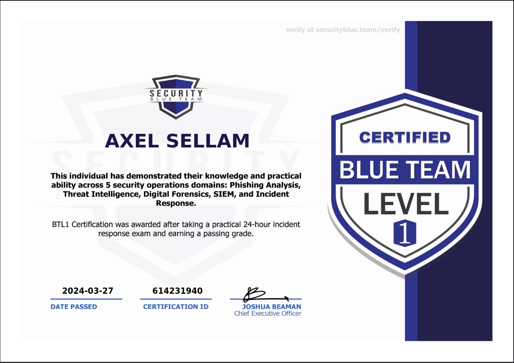

# 🟦 BTL1

After 6 hours and 20 questions about Siem analysis, forensics, threat intelligence, incident response and phishing analysis, i obtained the certification with the score of 90%.

<figure><figcaption></figcaption></figure>
